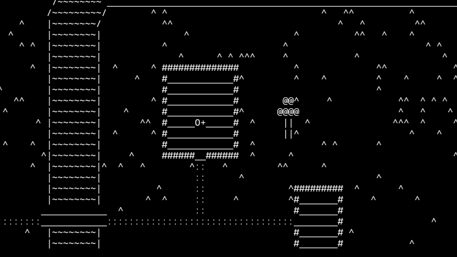

# Minetop
Top-down sandbox in terminal

## Control:

w - move up  
s - move down  
a - move left  
d - move right  

Shift + w - turn up  
Shift + s - turn down  
Shift + a - turn left  
Shift + d - turn right  

Enter - set block  
Backspace - delete block  

e - select block(press any key)  

1 - make block solid (with collision)  
2 - make block transparent on foreground (without collision)  
3 - make block transparent on background (without collision)  

q - quit game  
## Screenshot:


## Dependings:
+ libncurses-dev

## Compile:
```
gcc -o minetop main.c -lncurses
```
